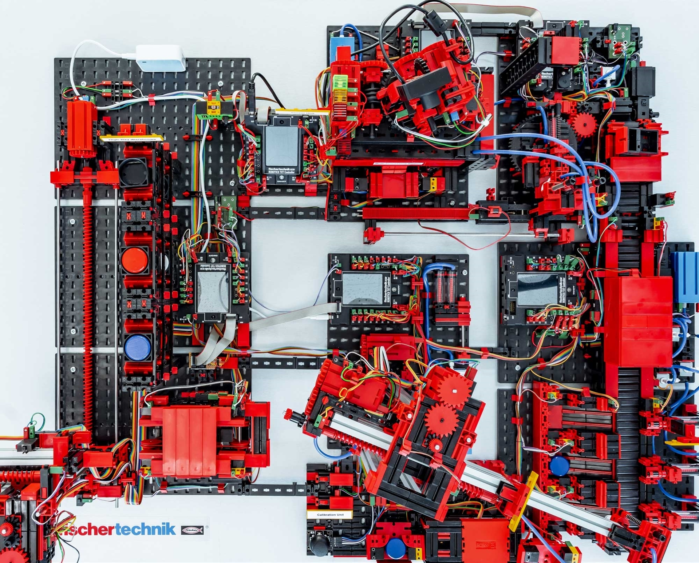

# EDPO – FT-Engrave: AirTag Engraving Factory

FT Engrave is an event-driven factory control system for engraving, polishing, and quality control of customized AirTags. Customers order an AirTag with color and engraving text of their choice. The factory refines a pre-colored AirTag by engraving the user-defined text, polishing it, and running it through an automated and a human operated quality control stage. The products are sorted based on the quality control outcome. The system is designed to handle machine and service failures gracefully, escalate cases where the item needs to be moved manually, or automatically trigger a re-run of the production of the product is damaged or fails quality control.



## Architecture

The architecture follows the ADRs in [`adr/`](adr/).

There are three service types in this system:

| Service type            | Responsibility                                      | Typical structure                                                              |
|-------------------------|-----------------------------------------------------|--------------------------------------------------------------------------------|
| Frontend Service        | displays and records user interactions              | Spring Boot, Kafka consumers/producers                                         |
| Workflow/Domain Service | Owns business process state and orchestration logic | Spring Boot, Camunda 7, Kafka consumers/producers                              |
| Integration Service     | Owns one machine boundary                           | Kafka consumers/producers, HTTP machine client, MQTT consumer and event filter |


## Project Structure

TODO: 

## Deployment

### Physical Factory

Production deployment uses [`docker/docker-compose.yml`](docker/docker-compose.yml) with [`docker/.env.production`](docker/.env.production). This points the integration services at the physical factory IPs and the production MQTT broker.

Before starting the stack, create the local MQTT secrets file:

```bash
cp docker/.env.mqtt.local.example docker/.env.mqtt.local
```

Edit `docker/.env.mqtt.local` with the broker credentials for the target factory:

```env
MQTT_USERNAME=...
MQTT_PASSWORD=...
```

Then start the production stack:

```bash
docker compose \
  --env-file docker/.env.production \
  -f docker/docker-compose.yml \
  up --build
```

### Simulator

The simulator environment replaces the physical factory and factory MQTT broker with a web-based simulation environment. This environment is designed to simulate the behavior of the physical factory as closely as possible and includes features to manipulate items and simulate failures at runtime for extensive testing. 

The simulator deployment adds [`docker/docker-compose.simulation.yml`](docker/docker-compose.simulation.yml), which starts the factory simulator and a local Mosquitto broker.

```bash
docker compose \
  --env-file docker/.env.simulation \
  -f docker/docker-compose.yml \
  -f docker/docker-compose.simulation.yml \
  up --build
```

Useful local links:

- Frontend: <http://localhost:3000>
- Factory simulator UI: <http://localhost:8081>
- Kafka UI: <http://localhost:8090>
- Port map: [`docker/PORTS.md`](docker/PORTS.md)

## Usage Example

The system behaves the same in production and simulation mode. For deponstration purposes, this example uses the simulated factory. For local testing, use the simulator stack and create an AirTag order through the backend API:

```bash
curl -X POST http://localhost:8082/api/orders \
  -H 'Content-Type: application/json' \
  -d '{
    "id": "order-demo-001",
    "color": "blue",
    "engravedText": "EDA 2026"
  }'
```

Open the simulator at <http://localhost:8081> to add items and interact with the factory. When the order was successfully created, the system will publish a command that an item of specified color should be added to the system. As the item is added to the intake, the production will start.

During the flow, user tasks will be started. These are handled through the respective Camunda engine's task list. 

## Key Configuration

Factory connection targets are configured in the Docker environment files:

| Concern | Real factory | Simulator |
| --- | --- | --- |
| Shared Kafka bootstrap | `docker/.env.production` | `docker/.env.simulation` |
| MQTT broker URL | `MQTT_BROKER_URL` | `MQTT_BROKER_URL` |
| Sorter HTTP target | `SORTER_HOST`, `SORTER_PORT` | `SORTER_HOST`, `SORTER_PORT` |
| Other machine HTTP targets | `VACUUM_GRIPPER_*`, `ENGRAVER_*`, `POLISHING_MACHINE_*`, `WORKSTATION_TRANSPORT_*` | Same variables |
| MQTT credentials | `docker/.env.mqtt.local` | Usually empty/demo for local Mosquitto |